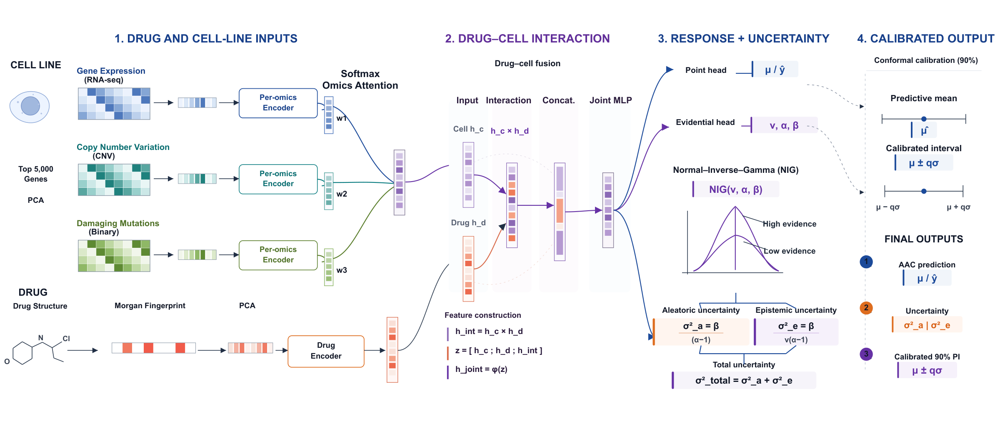

# EviDRP

**Decoupled evidential learning for calibrated drug response prediction.**

[](https://www.python.org/)
[](https://pytorch.org/)
[](#license)

EviDRP predicts anticancer drug response — quantified as the area above the dose–response curve
(AAC) — from a cell line's molecular portrait (expression, copy number, damaging mutations) and a
drug's chemical structure. Its central idea is that response learning and uncertainty learning
should not be optimized together. **Stage I** trains the predictive trunk and point head on an MSE
objective alone. **Stage II** freezes them and fits an evidential head on the detached prediction and
the frozen representation, so no gradient from the uncertainty objective can alter the learned
response function. That head parameterizes a Normal–Inverse-Gamma distribution, giving a point
prediction **and** two closed-form uncertainties in a single deterministic forward pass: *aleatoric*
(irreducible measurement noise) and *epistemic* (limited in-distribution evidence for that drug–cell
pair). A studentized split-conformal layer then turns them into calibrated 90% prediction intervals.

This repository is the code and result set behind the paper in
`EVIDRP_DECOUPLED EVIDENTIAL LEARNING FOR CALIBRATED DRUG RESPONSE PREDICTION.pdf`. Every number and
table in it comes from a file in `results/`, and every file in `results/` is written by a script
here.

## Results

Benchmark: 492,534 drug–cell measurements over 930 cell lines and 634 drugs (CTRPv2 + GDSCv2
responses joined to DepMap 24Q2 omics), on identical 3 × 128-channel cell features and 128-d drug
features, with 8:1:1 splits. Means over five seeds.

| Protocol | RMSE ↓ | Pearson *r* ↑ | R² ↑ | Spear(unc, \|err\|) ↑ | PICP (90%) | MPIW ↓ |
|---|---|---|---|---|---|---|
| **P0** in-domain | **0.077** | **0.878** | **0.771** | **0.373** | 0.899 | **0.206** |
| **P1** cold cells | **0.097** | **0.786** | **0.614** | **0.437** | 0.907 | **0.269** |
| **P2** drug-blind | **0.158** | **0.572** | **0.262** | **0.191** | 0.858 | **0.388** |

Against a multi-omics MLP and reproductions of BANDRP, AttnOmics and DELFOS (Table 1 of the paper):
EviDRP is best in-domain and drug-blind, and tied with DELFOS under cold cells (0.097 each).

- **Uncertainty quality and cost** (Table 2) — at ≈ nominal 90% coverage, EviDRP's intervals are the
  narrowest of the three single-pass/sampling estimators (MPIW 0.206 versus 0.260 for MC dropout and
  0.299 for a 5-member deep ensemble) at 133,509 parameters and **one** forward pass: 0.14 s for the
  full 49,254-row P0 test set, against 5.86 s for MC dropout (50 passes) and 0.36 s for the ensemble.
- **The decoupled schedule is what makes the uncertainty usable** (Table 3) — collapsing the two
  stages into a single annealed joint NIG fit costs accuracy (P0 0.077 → 0.082, P2 0.158 → 0.169) and
  destroys the uncertainty–error signal: Spearman(unc, |err|) falls from 0.37 to ≈ 0 on P0 and from
  0.44 / 0.19 to ≈ 0 on P1 / P2.
- **Selective prediction** (Fig. 2) — retaining the 50% most-confident in-domain predictions drops
  RMSE from ≈ 0.080 to 0.051, so the learned uncertainty ranks which predictions to defer.
- **Cross-dataset transfer** (§3.6) — the point predictor retains partial robustness under assay
  shift (RMSE 0.167 GDSCv2→CTRPv2, 0.152 CTRPv2→GDSCv2), but source-calibrated 90% intervals only
  reach 0.754 and 0.667 coverage: calibration does not transfer across platforms.

## Figures



**Fig. 1** — EviDRP. **Stage I** learns the response function alone (point head, MSE); **Stage II**
freezes it and fits the evidential head on the detached prediction, so the uncertainty objective
cannot move the prediction. The head parameterizes a Normal–Inverse–Gamma posterior, giving
aleatoric and epistemic variance in one forward pass, and a studentized split-conformal layer turns
them into the 90% interval.

The paper includes two figures, both committed under `paper/figs/`:

| Paper | File | Source |
|---|---|---|
| Fig. 1 | `fig1_architecture.pdf` | the diagram as drawn for the paper — no generator in this package (see Known gaps) |
| Fig. 2 | `fig4_riskcoverage.pdf` | `figures/make_figures_nature.py` |

`assets/fig1_architecture.png` is a raster of the committed Fig. 1 PDF, for display only.
Filenames carry their original draft number, which is not their position in the paper — `fig4_` is
Fig. 2. `make_figures_nature.py` exports editable-text PDF (`pdf.fonttype=42`), SVG
(`svg.fonttype=none`) and 600-dpi TIFF; only the PDF is committed.

## Repository layout

```
eviDRP/
├── data/          dataset + feature pipeline (run once, in order)
├── src/           model and training library (imported by experiments/)
├── experiments/   training, evaluation, cost analysis
├── figures/       figure generator -> paper/figs/
├── paper/figs/    the paper's two figures (PDF)
├── assets/        Fig. 1 raster, for this README
├── results/       every CSV / NPZ the scripts read and write
├── requirements.txt
└── PACKAGING_NOTES.md
```

`results/` is the contract between stages: experiments write metrics into it, the figure script reads
from it. Every path resolves relative to the repository root, so the folder can be moved anywhere.

## Installation

Python 3.12. `requirements.txt` pins the versions the included results were produced with:

```bash
git clone https://github.com/yummi-a/EviDRP.git
cd EviDRP
pip install -r requirements.txt
```

CPU-only PyTorch works; the paper numbers used the CUDA 12.1 build.

## Reproducing the paper

### 1. Data and features

Raw PharmacoSets and DepMap files go in `data/raw/`. They are not shipped (2.9 GB; see `.gitignore`).
All source data are public (table below).

```bash
cd data
python build_dataset.py            # -> processed/{response_long.csv,dataset_meta.json,...}
python make_splits.py              # -> splits/*.npy  (8:1:1, protocols P0/P1/P2, XD)
python make_features.py            # -> feat/  {P}_drugs.npy (128-d Morgan PCA) + z-score stats
python make_features_multimodal.py # -> feat/  {P}_cells_multi.npy, 3 x 128 = 384-d cell vector
```

### 2. Experiments

Run from `experiments/`, after `data/`. All training scripts read `splits/` and `feat/`, and write
into `../results/`.

```bash
cd ../experiments

python run_survey_seeds.py --P P0 --tag v3            # Table 1 (5 seeds); --P P1 / P2 likewise
python run_survey_seeds.py --P P0 --tag new --methods deepdtf,delfos    # Table 1: DELFOS
python run_survey_seeds.py --P P0 --tag abl_singlestage --methods evi2 --evi2-single-stage  # Table 3
python run_unc_baselines.py --P P0                    # Table 2: MC dropout, deep ensemble
python run_evi2_uncertainty.py                        # Fig. 2 + conformal curve
python run_xd_evi2.py --dir GDSC2CTRPv2               # section 3.6; also --dir CTRPv2toGDSC
python analyze_cost.py                                # Table 2: cost column
```

`experiments/run_survey_seeds.py` is the hub: the other four import `make_model` / `train_seed` /
`infer` from it, so it has to stay next to them.

### 3. Figures

```bash
cd ../figures
python make_figures_nature.py       # fig4_riskcoverage (Fig. 2)
```

Missing inputs make a figure script print `skip` and continue rather than crash, so partial runs are
safe.

## Script → result → paper artifact

Which result file backs which claim. Every CSV/NPZ in `results/` appears here.

| Script | Writes | Paper artifact |
|---|---|---|
| `data/*.py` | `processed/`, `splits/`, `feat/` | §3.1 experimental setup |
| `run_survey_seeds.py` | `survey_seeds_{P}_{tag}.csv` + `_summary.csv` | Table 1 (`v3`, `new`), Table 3 and the EviDRP rows of Table 2 (`v3`, `abl_singlestage`) |
| `run_unc_baselines.py` | `survey_seeds_P0_unc*.csv` | Table 2: MC dropout, deep ensemble |
| `analyze_cost.py` | `cost_table.csv` | Table 2: parameters, passes, seconds |
| `run_evi2_uncertainty.py` | `preds/P0_evi2_riskcoverage.npz`, `conformal_evi2.csv` | Fig. 2; §3.3 coverage 0.899 |
| `run_xd_evi2.py` | `survey_seeds_XD_*.csv`, `preds/XD_*_evi2v3.npz` | §3.6 cross-dataset table of numbers |

## Reproducibility

The `results/` directory here is the source of every number in the paper. Verified against the
archived runs:

- all 26 CSVs reproduce Tables 1–3 and §3.6 exactly (see `PACKAGING_NOTES.md` for the check);
- `fig4_riskcoverage.pdf` regenerates byte-identically from `make_figures_nature.py`;
- the import prelude of every script resolves (no missing modules).

**Known gaps.**

- The training scripts are not covered by that check: they need `processed/`, `splits/` and `feat/`,
  which are rebuilt from the public sources and not shipped, plus CPU/GPU hours. The verified chain
  is results → figures → paper, not raw data → results.
- **Fig. 1 is not reproducible here.** `paper/figs/fig1_architecture.pdf` is the framework diagram as
  it appears in the paper, but no script in this package draws it. The upstream generator
  (`new_data/exp/fig1_drawio.py`) renders a superseded single-row layout to the same filename — it
  would overwrite the paper's Fig. 1 with a different diagram, so it was left out of the package.
- The result CSVs carry a few method rows the paper does not report (extra survey baselines). They
  come from the same runs and are kept because the files are shared, not because the paper cites
  them. Likewise, re-running the kept scripts writes a couple of files the paper never uses
  (`results/ood_evi2.csv`, `results/preds/P0_evi2.npz`); they are not shipped.

## Data

| Source | Use |
|---|---|
| [CTRPv2](https://www.nature.com/articles/ncomms11137) | dose–response, area above the curve |
| [GDSCv2](https://www.nature.com/articles/s41586-019-1186-3) | dose–response, area above the curve |
| [DepMap 24Q2](https://depmap.org/portal/) (figshare 25880521) | expression, copy number, damaging mutations |

All source data are public. The dataset is built from scratch and does not reuse any pre-existing
processed release. Target metric `aac_recomputed` ∈ [0, 1]. Cell features: the top 5,000 variable
protein-coding genes of each omics layer (expression, copy number, damaging mutations) → 15,000 raw
→ 128 PCA components per layer, fitted on training cells only → the 3 × 128 (384-d) vector every
model in the paper consumes. Drug features: 2048-bit Morgan fingerprint (r = 2) → 128 PCA
components, fitted on training drugs only.

## Citation

```bibtex
@misc{evidrp2026,
  title  = {EviDRP: Decoupled evidential learning for calibrated drug response prediction},
  author = {Anonymous},
  year   = {2026},
  note   = {Code: https://github.com/yummi-a/EviDRP}
}
```

## License

Not yet chosen — add a `LICENSE` file before publishing. External data (CTRPv2, GDSCv2, DepMap) keeps
its own terms.

## Contact

[32409010@mail.imu.edu.cn](mailto:32409010@mail.imu.edu.cn)
